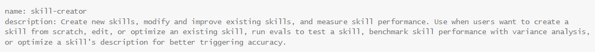

# 新系列一：关于AI知识库的一点拙见，非RAG

今天开一个新的系列，之前习惯性按古法技术博客的思路，分享方案+代码。但是vibe coding时代，我已经完全转向opencode + codex。

越来越觉得“code is cheap show me the prompt”不再是一个梗。

本系列分享我在vibe coding AI标书智能体的时候，到底是如何prompt的。

希望大家读完之后，能够学会搭建AI智能体，让AI正式成为你的生产力工具。

也接受批评和指正，欢迎讨论。

易标投标工具箱，项目源码、提示词已在 GitHub 完全开源：https://github.com/FB208/OpenBidKit_Yibiao

## 你不需要RAG

一提到知识库，很多人第一反应就是RAG，之前我也是，早在gpt-3.5时代，我就研究过RAG，精准度很一般，但是当时gpt-3.5只有4k上下文，实现知识库必须使用RAG。

习惯成自然，现在主流知识库还在使用RAG技术，但是从没有人解决RAG的精准度问题。

就拿我做的AI写标书场景来说。

知识库包括：装修改造施工项目、消防工程

**如果现在要写一个“消防改造施工项目”的标书，理应参考“消防工程”的知识库，但是大多数embedding模型都会优先匹配到“装修改造施工项目”，因为他们的语义更接近。**

在写标书的场景中，给AI一个错误的参考，还不如什么都不给，让AI自己凭经验写更精准。

## 我的解题思路

> 方案是原创的，未必是最优解，如果佬们有更好的方案，欢迎指正。

我的知识库方案是在研究skill技术时获得的灵感，AI是如何在众多skill中自动选中本次任务需要执行哪个skill？

每个skill的开头都有一段元数据，简单描述了AI应该在何时使用这个skill。

在每次AI请求时，会携带所有已安装skill的描述信息，由AI判断是否使用，确定使用后才去读取skill的真正内容。

这不是巧了吗，这不跟知识库一样吗！！！

于是就有了AI标书知识库功能~

简易流程：上传文档后先用AI提取知识条目。然后匹配正文，把原文内容填入对应知识条目，再生成一段“使用方式”。在写标书的时候，自动根据要编写的内容判断使用哪个知识条目。

## 详细介绍

本来写了一篇长文，但是越写越越觉得都是废话，于是精简成了下面的表格，对细节感兴趣的可以直接看我的代码仓库。

| 阶段            | 处理逻辑                                         | 目的                                      |
| --------------- | ------------------------------------------------ | ----------------------------------------- |
| 构建 block      | 按标题、段落、表格、列表切分，再做语义合并       | 给原文片段编号，方便后面精确匹配          |
| 清理无效 block  | 过滤页码、目录、封面、签章、过短碎片、格式残留等 | 避免垃圾内容进入知识库                    |
| 第一轮提取条目  | AI 从全文提取可复用主题，只输出标题和使用方式    | 先判断“这份资料有哪些可复用内容”          |
| 第二轮补漏      | AI 检查有没有遗漏主题，只补新增条目              | 减少漏掉小但常用的内容                    |
| 合并候选条目    | 去重、编号，生成稳定条目 ID                      | 得到可匹配的候选知识条目                  |
| 分批匹配原文    | AI 判断每个条目对应哪些 block，只返回 block 范围 | 把真实原文挂回条目                        |
| 遗漏 block 补漏 | 没有被匹配到的原文block，再让AI跑一遍            | 防止有价值原文没有进入任何条目            |
| 保存最终条目    | 程序按 block ID 拼回原文内容                     | 最终知识条目 = 标题 + 使用方式 + 原文素材 |

